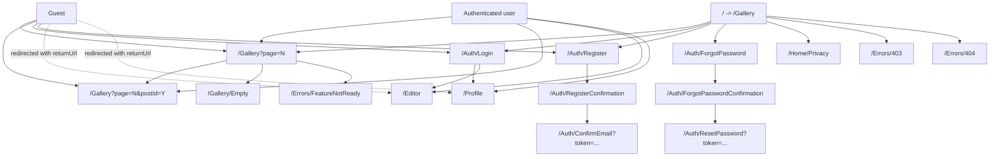
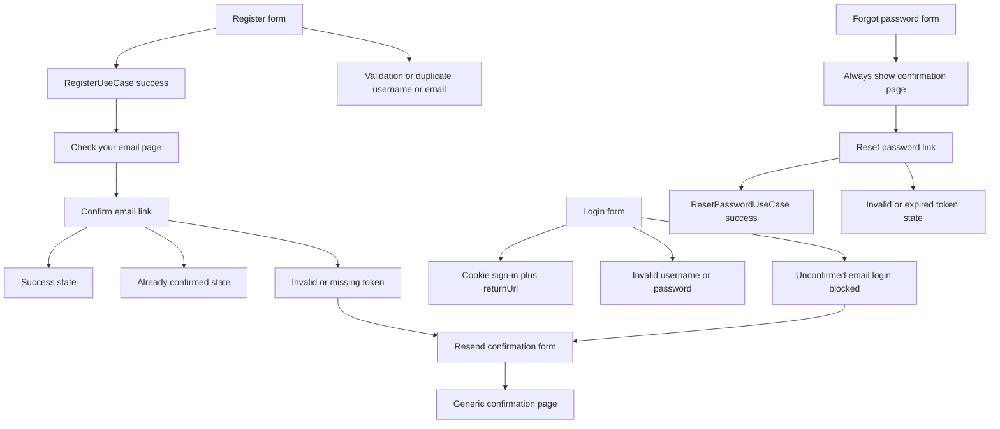
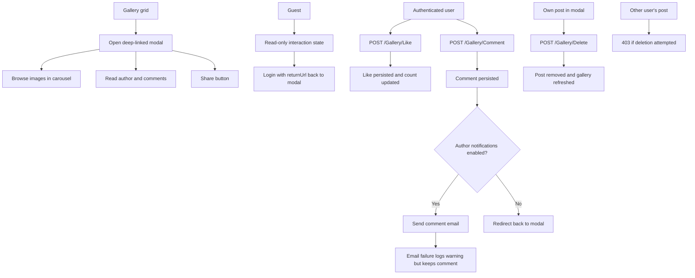
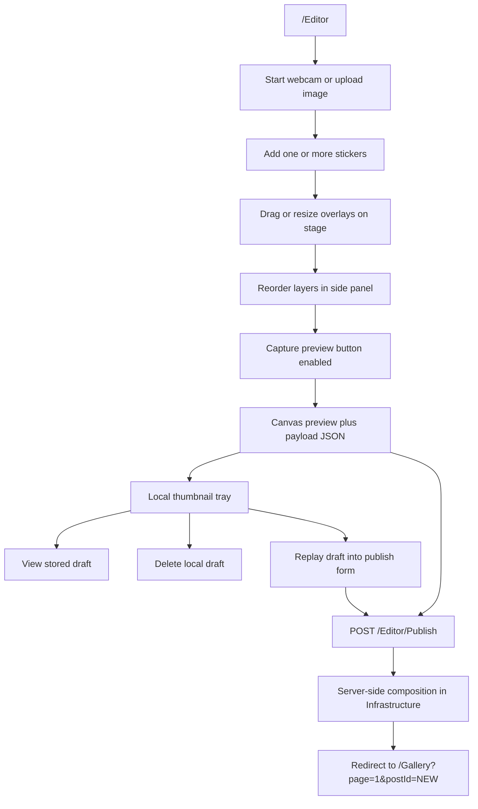

# Camagru

Camagru is split into four projects that preserve the existing Clean Architecture boundaries:

- `src/Camagru.Domain`
- `src/Camagru.Application`
- `src/Camagru.Infrastructure`
- `src/Camagru.Web`

The solution now wires the core subject flows end to end:

- Auth and profile flows are wired through Application-layer use cases.
- Gallery listing, modal details, likes, comments, and owner-only deletion are persisted.
- Comment notification emails respect the profile notification preference.
- The editor publishes a real server-composed montage while keeping the existing Razor/CSS/ES-module frontend architecture intact.

## Wiring Notes

- Fully wired to Application use cases:
  - Register
  - Confirm email
  - Resend confirmation email
  - Login
  - Logout
  - Forgot password
  - Reset password
  - Load profile
  - Update username, display name, and bio
  - Change email
  - Change password
  - Update notification preferences
  - Delete account
- Gallery and editor flows now wired through Application + Infrastructure:
  - Persisted public gallery feed with pagination
  - Deep-linkable post modal with real comments and like counts
  - Toggle like
  - Add comment with non-blocking email notification warnings
  - Owner-only post deletion
  - Server-side montage composition and publish
  - Server-side editor upload validation for PNG/JPEG files
- Still intentionally lightweight:
  - Draft tray items remain browser-local until published
  - Overlay catalog is rendered into the page instead of exposed as an AJAX endpoint
  - Webcam denial falls back to the upload path in the editor UI
- Important nuance:
  - `UpdateProfileUseCase` accepts an email field, but the current Application implementation does not actually apply email changes. The Web UI therefore routes email updates only through `ChangeEmailUseCase`.

## Data Model Overview

- `User` owns many `Post`, `Comment`, and `Like` records and stores the email notification preference.
- `Post` belongs to one user and contains the published montage metadata plus one or more `Image` records.
- `Comment` belongs to one post and one user.
- `Like` is unique per `(PostId, UserId)`.
- `Overlay` stores the reusable sticker catalog that the editor and server-side compositor share.

## How To Run

1. Configure the required environment variables:

```bash
POSTGRES_HOST=
POSTGRES_PORT=
POSTGRES_DB=
POSTGRES_USER=
POSTGRES_PASSWORD=
SMTP_HOST=
SMTP_PORT=
SMTP_USER=
SMTP_PASSWORD=
APP_BASE_URL=
```

2. Restore and build the solution:

```bash
MSBuildEnableWorkloadResolver=false dotnet build ./Camagru.sln -m:1 /nr:false -p:UseSharedCompilation=false
```

3. Run the MVC app:

```bash
dotnet run --project src/Camagru.Web/Camagru.Web.csproj
```

4. Run the full validation script:

```bash
./scripts/verify.sh
```

On Windows:

```powershell
pwsh ./scripts/verify.ps1
```

The helper scripts force single-node MSBuild and disable workload-resolver probing because the local `.NET SDK 10.0.200` environment used during validation can otherwise fail before compilation begins.

## UX Site Map



## Auth Flow



## Gallery Flow



## Editor Flow


