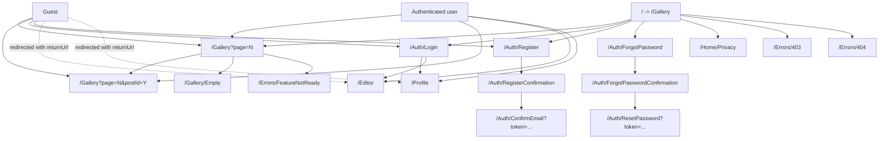
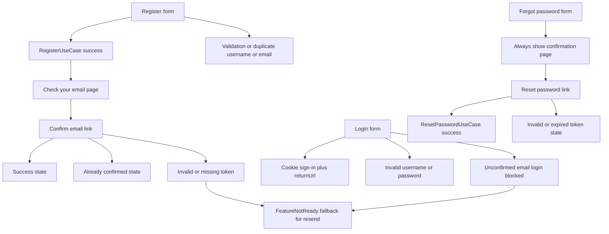
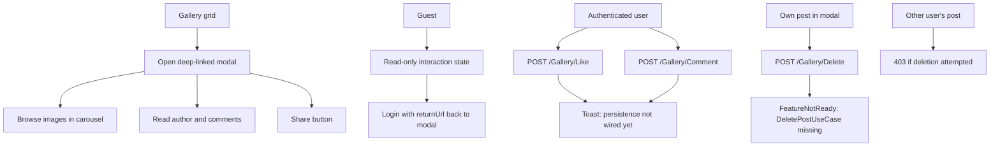
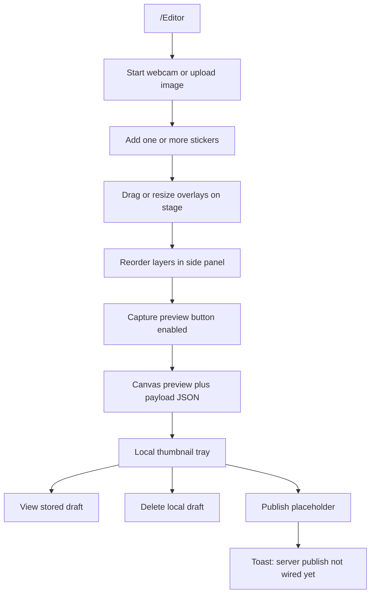

# Camagru

Camagru is split into four projects that preserve the existing Clean Architecture boundaries:

- `src/Camagru.Domain`
- `src/Camagru.Application`
- `src/Camagru.Infrastructure`
- `src/Camagru.Web`

The current frontend work is intentionally isolated to `Camagru.Web`. Authentication and profile flows are wired to existing Application-layer use cases, while gallery mutations and editor publishing remain interactive Web placeholders that can be replaced later with real use cases without changing the UI structure.

## Auth Wiring And Placeholders

- Fully wired to Application use cases:
  - Register
  - Confirm email
  - Login
  - Logout
  - Forgot password
  - Reset password
  - Load profile
  - Update username, display name, and bio
  - Change email
  - Change password
  - Update notification preferences
  - Delete account
- Feature-flagged or documented placeholders in Web:
  - Resend confirmation email
  - Gallery like persistence
  - Gallery comment persistence
  - Gallery post deletion
  - Editor publish and save flow
- Important nuance:
  - `UpdateProfileUseCase` accepts an email field, but the current Application implementation does not actually apply email changes. The Web UI therefore routes email updates only through `ChangeEmailUseCase`.
- Missing Application contract currently documented in the UI:
  - `ResendConfirmationEmailUseCase`

## How To Run

1. Restore and build the solution:

```bash
dotnet build ./Camagru.slnx
```

2. Run the MVC app:

```bash
dotnet run --project src/Camagru.Web/Camagru.Web.csproj
```

3. Run the full validation script:

```bash
./scripts/verify.sh
```

On Windows:

```powershell
pwsh ./scripts/verify.ps1
```

The helper scripts force single-node MSBuild and disable workload-resolver probing because the local `.NET SDK 10.0.200` environment used during validation can otherwise fail before compilation begins.

## UX Site Map



## Auth Flow



## Gallery Flow



## Editor Flow


