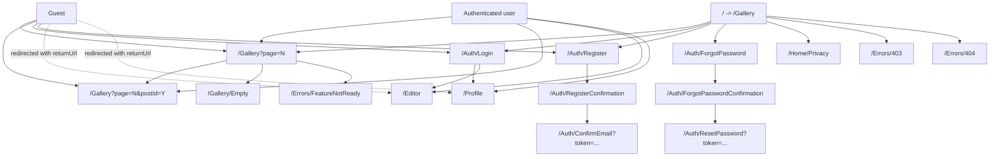
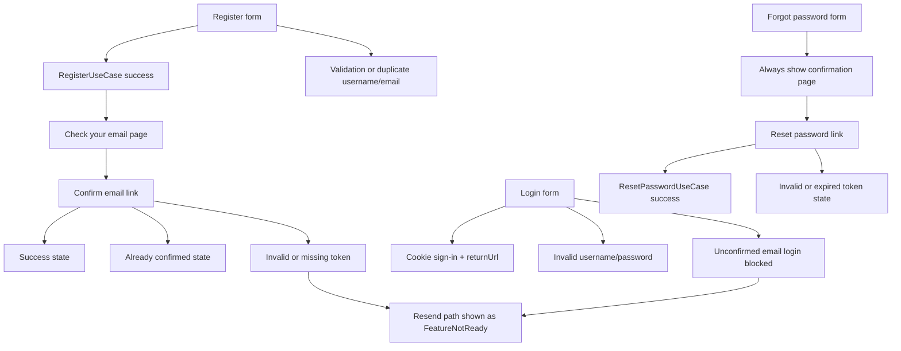
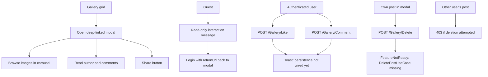
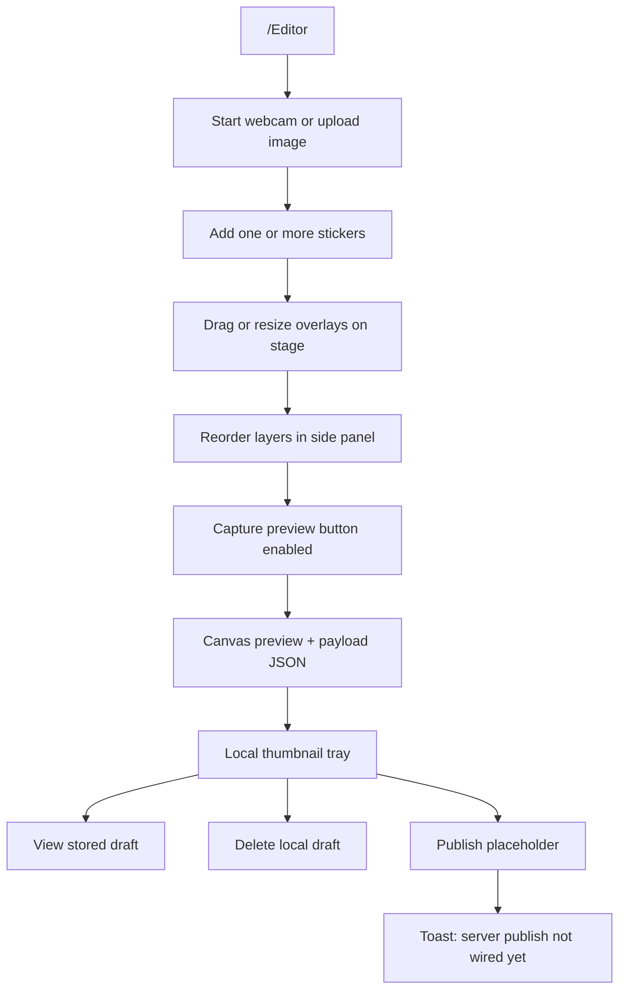

# Camagru Web UI

This frontend implementation stays inside `Camagru.Web` and keeps the authentication/profile flows wired to existing Application-layer use cases. The gallery interactions and editor publishing workflows are intentionally staged as Web-only placeholders so they can be replaced later without changing the UI architecture.

## How To Run

1. Configure the existing environment variables used by the solution for PostgreSQL and SMTP.
2. Start the app with `dotnet run --project src/Camagru.Web/Camagru.Web.csproj`.
3. Open `/Gallery` for the public feed or `/Editor` after signing in.

## Wiring Notes

- Fully wired to Application use cases:
  - Register
  - Confirm email
  - Login and logout
  - Forgot password
  - Reset password
  - Profile load
  - Update username/display name/bio
  - Change email
  - Change password
  - Update notification preferences
  - Delete account
- Explicit Web-only placeholders:
  - Gallery like persistence
  - Gallery comment persistence and email-on-comment flow
  - Gallery post deletion use case
  - Editor publish/save flow
  - Resend confirmation email flow
- Important nuance:
  - `UpdateProfileUseCase` accepts `Email` in its request contract, but the current implementation does not apply email changes. The UI therefore routes email updates only through `ChangeEmailUseCase`.
- Missing contract documented in the UI:
  - `ResendConfirmationEmailUseCase`

## Site Map And Access

## Auth Flow And Edge Cases

## Gallery Interaction Flow

## Editor Workflow

