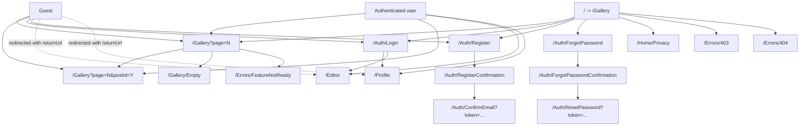
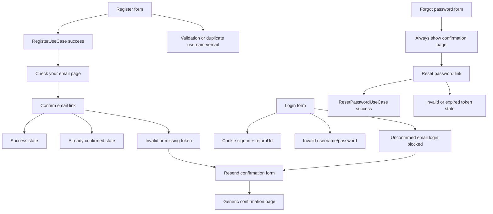
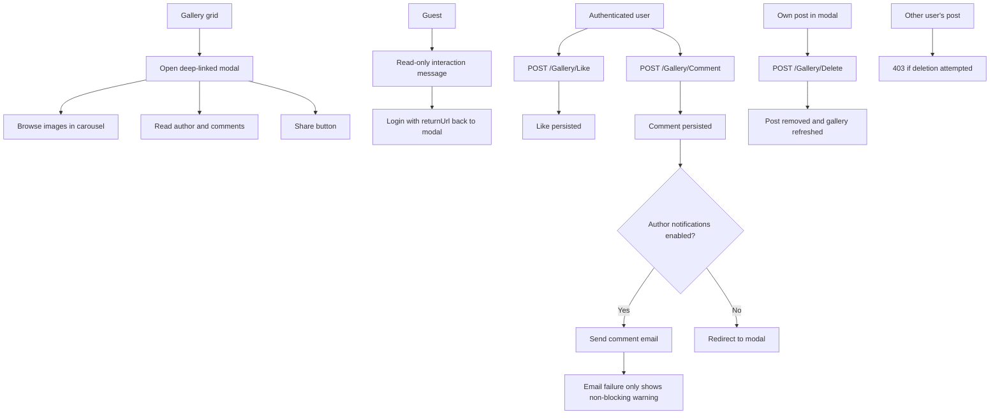
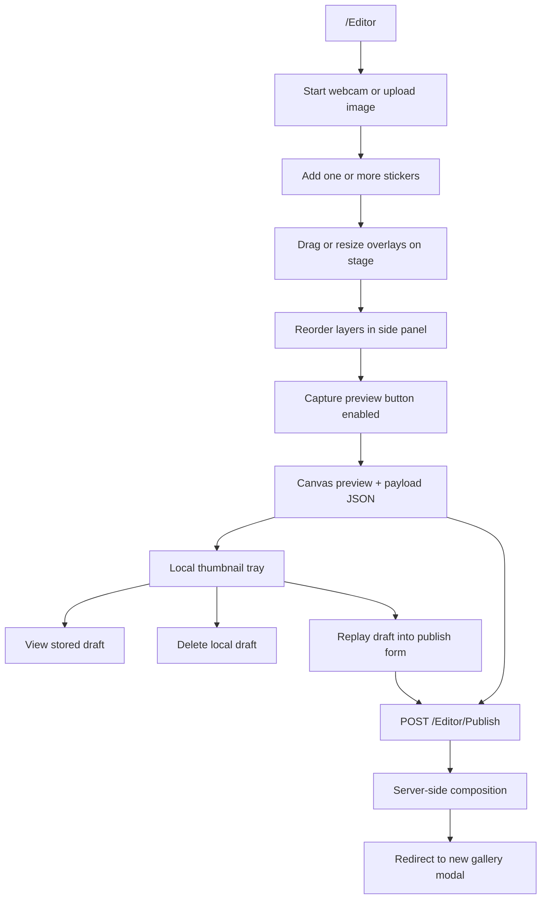

# Camagru Web UI

This frontend implementation stays inside `Camagru.Web`, but it now sits on top of fully wired auth, gallery, and publish flows across the solution. The UI structure remains modular Razor + CSS + ES modules, while the actual persistence and server-side composition now run through Application and Infrastructure services.

## How To Run

1. Configure the existing environment variables used by the solution for PostgreSQL and SMTP.
2. Build the solution with `MSBuildEnableWorkloadResolver=false dotnet build ./Camagru.sln -m:1 /nr:false -p:UseSharedCompilation=false`.
3. Start the app with `dotnet run --project src/Camagru.Web/Camagru.Web.csproj`.
4. Open `/Gallery` for the public feed or `/Editor` after signing in.

## Wiring Notes

- Fully wired to Application use cases:
  - Register
  - Confirm email
  - Resend confirmation email
  - Login and logout
  - Forgot password
  - Reset password
  - Profile load
  - Update username/display name/bio
  - Change email
  - Change password
  - Update notification preferences
  - Delete account
- Fully wired gallery/editor flows:
  - Gallery list and modal details from persisted posts
  - Like toggle persistence
  - Comment persistence plus optional author email notifications
  - Owner-only post deletion
  - Editor publish through server-side image composition
  - Editor upload validation for PNG/JPEG files with server-side size and MIME checks
- Still local-only by design:
  - Draft tray persistence before publish
  - Webcam denial or unavailability nudges the user to the upload flow
- Important nuance:
  - `UpdateProfileUseCase` accepts `Email` in its request contract, but the current implementation does not apply email changes. The UI therefore routes email updates only through `ChangeEmailUseCase`.

## Site Map And Access

## Auth Flow And Edge Cases

## Gallery Interaction Flow

## Editor Workflow

